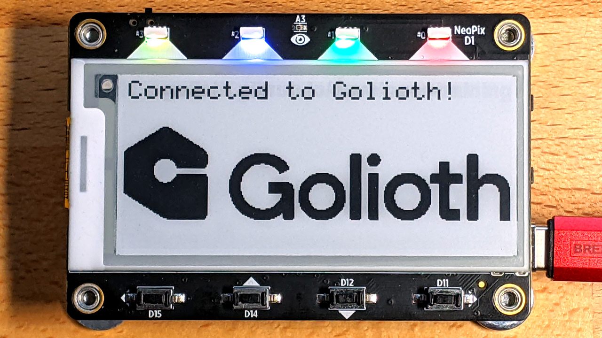

# Golioth Demo First Steps

## Overview

We are using a pre-provisioned device to have an “out of the box” experience for trying out the Golioth Cloud. Our goal is to have the trainee sending data packets back to Golioth as fast as possible. We will go through some simple exercises before switching over to building projects with Zephyr.

We will be reviewing 3 of the 4 Golioth features currently available:
* Logging
* LightDB State
* LightDB Stream

:::note
For in-person training, your device will automatically connect to the Golioth Cloud. Please [email the Developer Relations team](mailto:devrel@golioth.io) and tell us the address you used to register your Golioth account ([in the previous step](golioth-intro/signup)) so that we can share the device with your account.

If you are guiding yourself through this training, you will need to install the Zephyr toolchain and compile the [golioth-demo](https://github.com/golioth/magtag-demo/tree/golioth-demo) with your own WiFi and Golioth credentials.
:::

With a provisioned device in hand, it's time to put it to use. Remember, this stage of the training is to showcase the various ways to send data to the Golioth cloud.

## Push a button, hear a beep

This is a very simple demo. Press one of the buttons on the bottom of the board (D11, D12, D14, D15). You will hear a tone and see the NeoPixels (LEDs at the top of the board) turn on and off. Fun!

Of course there is a lot more happening that we don't see on the device itself. Next we'll dive into the IoT features of this demo.
